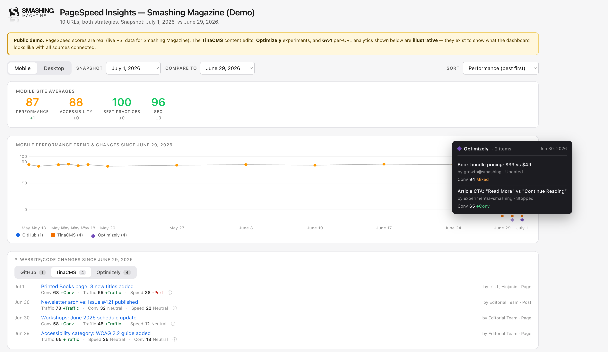
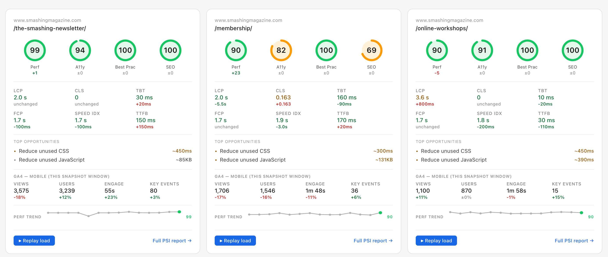
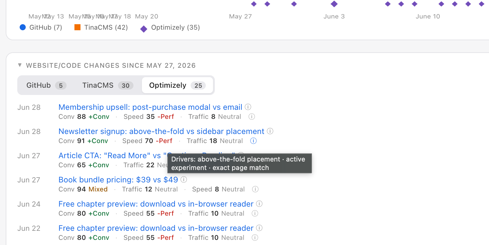

# PSI Dashboard

Weekly Lighthouse snapshots for the URLs that matter, with the code changes, content edits, A/B experiments, and analytics that could explain movement overlaid on the same timeline. Self-hosted on GitHub Actions + Cloudflare Pages. Zero per-site SaaS cost.

**Live demo:** https://psi-dashboard-smashing-demo.pages.dev (real PSI data for Smashing Magazine)

**More of my work:** [ambarshrivastava.com/portfolio](https://ambarshrivastava.com/portfolio)

---

## What problem this solves

A freelance consulting client called asking why their homepage LCP jumped from 2.1s to 3.4s. Answering used to take 30 minutes of switching between tabs: PSI results this week, PSI results last week, GitHub commit history, deploy logs, sometimes the CMS revision history.

This tool closes that loop. Every Wednesday at 7am Central, a GitHub Actions workflow captures a snapshot: Lighthouse scores for a hand-picked set of high-traffic URLs, merged PRs from the client's repo for the same week, CMS content edits, A/B experiment activity, and per-URL GA4 analytics. The trend chart overlays all of them on the same timeline so cause and effect are visible in one frame.

Answer time is now closer to 15 seconds.

## What you can see in the live demo

- **Weekly PageSpeed snapshots** for 10 Smashing Magazine URLs (real PSI data, fetched weekly)
- **Global trend chart** with per-source change markers color-coded by type (GitHub circles, TinaCMS squares, Optimizely diamonds) that hover with rich detail cards
- **Recent Changes** section with tabbed sources, deduped across snapshots, filtered to the compare-window you pick
- **Activity impact scoring** on every change: Speed / Traffic / Conversion likelihood, with directional tags (`+Conv`, `-Perf`, `Mixed`, `Neutral`) and driver reasons on hover
- **rrweb session replay** on every snapshot — click Replay on any card to watch the actual page render, frame by frame, throttled to match PSI's Slow 4G + 4x CPU on mobile
- **Top opportunities per card**, auto-extracted from Lighthouse's opportunity audits with estimated savings
- **GA4 per-URL strip** showing Views, Users, Engagement Time, Key Events for each URL, split by device, with week-over-week deltas

### Per-URL card

Each URL gets its own card with perf rings, Core Web Vitals metrics, top opportunities, week-over-week GA4 metrics (split by device), and a mini perf trend sparkline. Click **Replay load** on any card to watch the rrweb-captured page render.

### Scoring + drivers on hover

Every change item gets three likelihood scores (Speed, Traffic, Conversion) with directional tags. Hover the score line or the info glyph to see the drivers behind the score — short phrases like "above-the-fold placement", "active experiment", "pricing-adjacent page" that explain why the score is what it is.

## What's illustrative vs real

The demo uses **real Smashing Magazine PSI data** (public PSI API, no auth needed).

The **CMS content edits, A/B experiments, and GA4 analytics are illustrative** — hand-authored templates rotated into each snapshot window with a deterministic per-week PRNG. A banner at the top of the demo makes this explicit. The point is to show what the dashboard looks like with every source connected; the underlying integrations (WordPress REST, GrowthBook, Optimizely, GA4 Data API) are real and used against live client data in the private production instance.

## What I think is interesting about it

- **Self-hosted, zero per-site cost.** GitHub Actions for the weekly cron, Cloudflare Pages for the deploy. 
- **Multi-tenant matrix.** One codebase, one deploy pipeline, N clients configured via `clients/<id>/config.json`. Each client is a matrix job in the workflow; adding a client is a config change.
- **rrweb session replay** rendered inline so non-technical stakeholders can see why a page feels slow, not just what the numbers say.
- **Rules-based activity scoring.** ~30 regex patterns on change titles infer Speed / Traffic / Conversion likelihood. Cookie banners score high speed risk, pricing tests score mixed on conversion, SEO metadata scores high on traffic. Pre-authored scores (for the demo) win over inference; production clients rely on inference.
- **Pluggable fetcher pattern.** Each data source (GitHub, WordPress, GrowthBook, TinaCMS, Optimizely, GA4) is a standalone script gated by config. Missing config or missing secret makes the source skip cleanly, so the workflow can run for clients that only wire up a subset.
- **Content-Type-aware fetch chain** on rrweb replay files so Cloudflare's SPA-fallback HTML never blows up JSON parsing when a recording is missing.
- **Rebase-safe workflow commit-back.** The weekly workflow commits new snapshot files to `main`; `-X theirs` on the rebase auto-resolves conflicts when two runs land on the same date.

## Tech stack

- Node.js 20 (fetch scripts, snapshot builder, demo data generator)
- Vanilla JS + inline SVG for the dashboard (single HTML file, no build step, no framework)
- GitHub Actions (weekly cron + on-demand)
- Cloudflare Pages (deploy target)
- Google PageSpeed Insights API, GA4 Data API, WordPress REST API, GrowthBook API, Optimizely
- rrweb + Puppeteer for session recordings

## Running it yourself

See [SNAPSHOT_GUIDE.md](SNAPSHOT_GUIDE.md) for the operational docs: folder layout, how to add a client, config schema, secrets to set, and how to trigger snapshots manually.

## Why I built it

I do freelance product and consulting work with a few marketing-led sites (WordPress, Next.js, static-site generators). Stakeholders often ping me asking why scores moved. The answer almost always lives in a code change, new experiment or content edit that shipped that week; tracing it was the annoying part.

Built this with Claude Code as my pair programmer. The demo you're looking at now has grown well past that original scope into a 5-source, scored, per-URL analytics view. Everything on this repo is what actually runs — same code path as the private production instance, minus the client-specific configs and the real GA4/GrowthBook/WordPress credentials.
